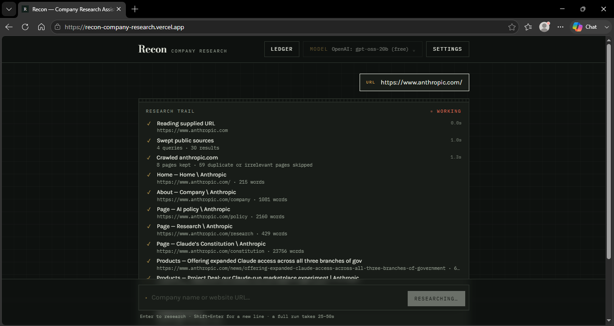
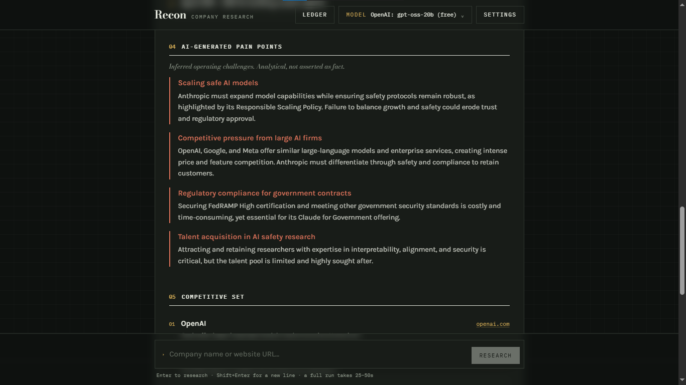
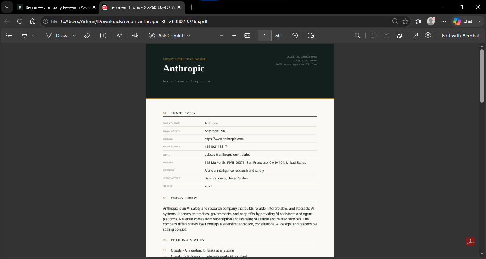
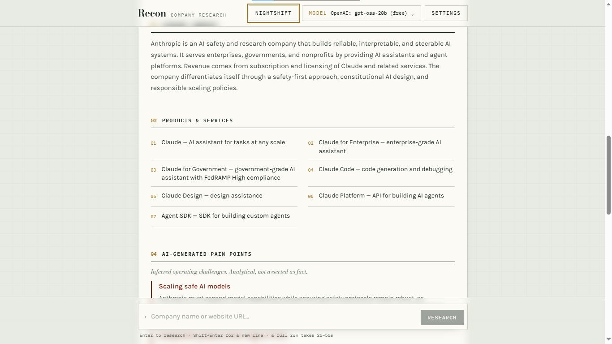
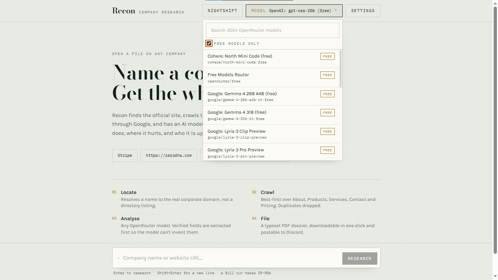
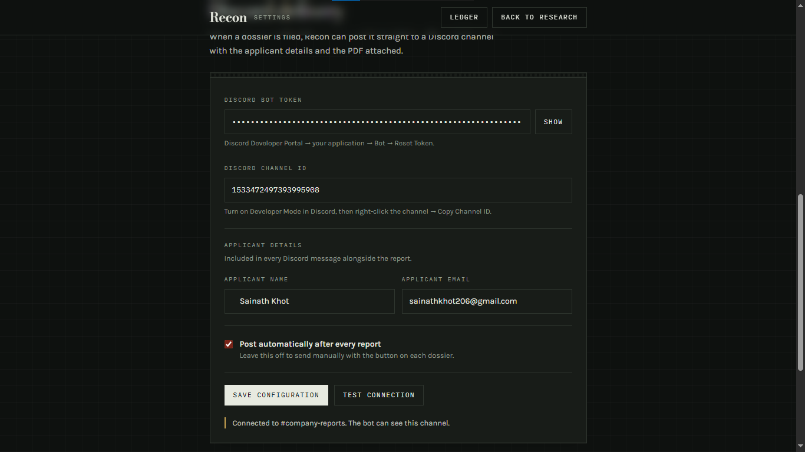
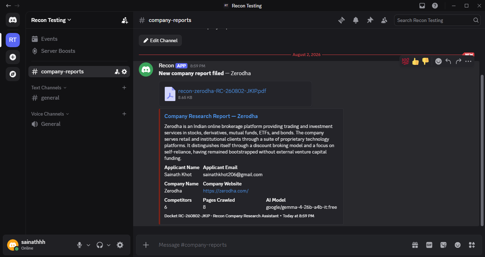

# Recon — AI-Powered Company Research Assistant

Give it a company name or a website URL. It finds the official site, crawls the pages that matter,
sweeps public sources through Google, has an OpenRouter model of your choosing write the analysis,
verifies the competitor set, and files a typeset PDF dossier — optionally posting it straight to Discord.

**Live deployment:** https://recon-company-research.vercel.app/

---

## Contents

- [Screenshots](#screenshots)
- [What it does](#what-it-does)
- [Quick start](#quick-start)
- [Environment variables](#environment-variables)
- [Getting the API keys](#getting-the-api-keys)
- [Discord integration](#discord-integration)
- [Deploying to Vercel](#deploying-to-vercel)
- [Architecture](#architecture)
- [Implementation notes](#implementation-notes)
- [Project structure](#project-structure)
- [Troubleshooting](#troubleshooting)

---

## Screenshots

### Chat interface and live research trail
Every crawled page appears in the trail as it lands, with its classification, word count and elapsed
time. Progress is streamed over server-sent events — nothing here is simulated.



### The filed dossier
Company identification, summary, products, AI-generated pain points, verified competitor set and the
full evidence trail.



### Generated PDF report
Typeset server-side with `pdf-lib`. Same builder feeds the download and the Discord upload.



### Dark theme
Both palettes ship. The theme follows the operating system preference on first visit and is
remembered after that.



### Model selection
The full live OpenRouter catalogue, searchable, with a free-models filter.



### Discord integration settings
Bot token, channel ID, applicant details, and a connection test that distinguishes a bad token from
a missing permission from a wrong channel.



### Report delivered to Discord
Applicant name and email, company name and website, run statistics, and the PDF as an attachment.



A sample generated PDF is included at [`docs/sample-report.pdf`](docs/sample-report.pdf).

---

## What it does

| Capability | How |
| --- | --- |
| Accepts a company **name** or a **URL** | Input is classified client- and server-side; names are resolved to the official domain before anything else runs |
| **Website crawling** | Custom best-first crawler over the same origin, prioritised by page type, with duplicate and near-duplicate detection |
| **Search integration** | Serper.dev — website resolution, contact discovery, competitor discovery, and competitor URL verification |
| **AI analysis** | OpenRouter, any model in the catalogue, picked at runtime from a searchable dropdown |
| **Competitor analysis** | Model proposes, Serper verifies each homepage independently |
| **PDF report** | Server-side typeset A4 dossier via `pdf-lib`, one-click download |
| **Chat interface** | Streaming research trail, dossier cards, mobile-first |
| **Discord delivery** | Bot token + channel ID in the settings page; posts applicant details, company details and the PDF as an attachment |

Nothing is persisted. No database, no accounts, no report history — settings live in `localStorage`,
and in-flight results live in memory only.

---

## Quick start

Requires **Node.js 18.17+** (Node 20 or 22 recommended).

```bash
git clone <your-repo-url>
cd recon-company-research

npm install

cp .env.example .env.local
# open .env.local and paste your SERPER_API_KEY and OPENROUTER_API_KEY

npm run dev
```

Open http://localhost:3000.

Try `Stripe`, or paste `https://zerodha.com`.

Production build:

```bash
npm run build
npm start
```

---

## Environment variables

Create `.env.local` in the project root (git-ignored). `.env.example` documents the same list.

| Variable | Required | Description |
| --- | --- | --- |
| `SERPER_API_KEY` | Recommended | Serper.dev API key. Used for website resolution, public-source sweeps and competitor verification. A run costs 5–11 queries. |
| `OPENROUTER_API_KEY` | Recommended | OpenRouter API key. The model is chosen in the UI, so one key covers every model. The default is `openai/gpt-oss-20b:free`, which needs no credit. |
| `NEXT_PUBLIC_SITE_URL` | No | Your public URL. Sent to OpenRouter as `HTTP-Referer` for attribution. Defaults to `http://localhost:3000`. |
| `DISCORD_BOT_TOKEN` | No | Server-side fallback for Discord delivery. Values entered at `/settings` take priority. |
| `DISCORD_CHANNEL_ID` | No | Server-side fallback channel. Values entered at `/settings` take priority. |

### Where the API keys live

Keys can be supplied two ways, and the app works with either:

1. **Server environment variables** (recommended for the deployed demo). Set them in Vercel and the
   app works immediately for any visitor, with no setup.
2. **In the browser, at `/settings` → API keys.** Anything entered there is stored in `localStorage`,
   sent with the research request, and takes priority over the server's values for that visitor only.

That is why neither variable is strictly required: a deployment with no environment variables at all
still works as long as the visitor pastes their own keys. Verified — with zero server-side keys, a
request carrying browser-supplied keys completes the full pipeline.

Both Discord variables are optional: the evaluator can paste a token and channel ID directly into
the in-app settings page without redeploying.

---

## Getting the API keys

**Serper.dev** — sign up at [serper.dev](https://serper.dev), then Dashboard → API Key. The free
tier includes 2,500 queries, which is roughly 250–400 full research runs.

**OpenRouter** — sign up at [openrouter.ai](https://openrouter.ai), then
[openrouter.ai/keys](https://openrouter.ai/keys) → Create Key. No credit card needed: the app
defaults to `openai/gpt-oss-20b:free`, and the model dropdown has a **Free models only** filter.
Free models are capped at 20 requests/minute and 50/day on an account that has never bought credits.

---

## Discord integration

1. Go to [discord.com/developers/applications](https://discord.com/developers/applications) → **New Application**.
2. **Bot** → **Reset Token** → copy the token.
3. **OAuth2 → URL Generator** → scope `bot`, permissions **View Channels**, **Send Messages**, **Attach Files**.
4. Open the generated URL and add the bot to your server.
5. In Discord, enable **Settings → Advanced → Developer Mode**, then right-click the target channel → **Copy Channel ID**.
6. In Recon, open **Settings**, paste the token and channel ID, add your applicant name and email, then **Save configuration** and **Test connection**.

With **Post automatically after every report** enabled, each completed dossier is pushed to the
channel as an embed containing:

- Applicant Name and Applicant Email Address
- Company Name and Company Website
- Model used, pages crawled, competitor count
- The generated PDF as a file attachment

The **Send to Discord** button on every dossier does the same thing on demand.

---

## Deploying to Vercel

1. Push this repository to GitHub.
2. [vercel.com/new](https://vercel.com/new) → import the repository. Framework preset is detected as Next.js; no build settings need changing.
3. **Settings → Environment Variables** → add `SERPER_API_KEY` and `OPENROUTER_API_KEY` (and `NEXT_PUBLIC_SITE_URL` once you know the domain). Apply to Production, Preview and Development.
4. **Deploy.**

The research route declares `export const maxDuration = 60`, which is the Hobby-plan ceiling. The
pipeline is budgeted to finish inside it: crawling is capped at 8 pages with 7-second per-page
timeouts, and the AI call is capped at 38 seconds.

Any Node-capable host works — Netlify (with `@netlify/plugin-nextjs`), Cloudflare (Node compat),
Render, Railway, Fly. The only hard requirement is a Node runtime that supports streaming responses;
the API routes use the Node runtime, not Edge, because `pdf-lib` needs it.

---

## Architecture

```
Browser (chat UI)
    │  POST /api/research  { query, model }
    ▼
┌──────────────────────────────── /api/research (SSE stream) ───────────────────────────────┐
│                                                                                            │
│  1. RESOLVE     name → official domain          serper.ts    knowledge panel, then scored  │
│                 URL  → normalised origin                     organic results               │
│                                                                                            │
│  2. SEARCH      4 parallel Serper queries       serper.ts    overview · contact ·          │
│                                                              products · competitors        │
│                                                                                            │
│  3. CRAWL       best-first, 8 pages, conc. 4    crawler.ts   priority scoring, dedupe,     │
│                                                              content extraction            │
│                                                                                            │
│  4. EXTRACT     deterministic facts             extract.ts   schema.org JSON-LD, tel:/     │
│                                                              mailto:, contact-page regex   │
│                                                                                            │
│  5. ANALYSE     one JSON completion             analyse.ts   budgeted corpus + verified     │
│                                                 openrouter.ts fields + search context      │
│                                                                                            │
│  6. VERIFY      competitor homepages            serper.ts    one search per unconfirmed URL │
│                                                                                            │
│  7. COMPILE     CompanyReport + evidence trail                                             │
└────────────────────────────────────────────────────────────────────────────────────────────┘
    │  server-sent events: step · report · error
    ▼
Dossier card ──► POST /api/pdf     ──► pdf-lib ──► download
             └─► POST /api/discord ──► pdf-lib ──► Discord Bot API (multipart upload)
```

---

## Implementation notes

**The crawler is best-first, not breadth-first.** `lib/crawler.ts` scores every discovered URL by
page type — About and Products outrank Customers, which outranks everything unlabelled — and always
fetches the highest-scoring frontier next. With a budget of 8 pages that difference matters: a plain
BFS on a marketing site spends the budget on blog archive pages. Depth is penalised, paths deeper
than three segments are dropped, and login, cart, legal, tag, category and author routes are excluded
by pattern along with 30-odd non-HTML extensions.

**Duplicates are caught two ways.** URLs are canonicalised first — hash removed, tracking params
stripped, `/index.html` and trailing slashes normalised — so `?utm_source=` variants never enter the
queue. Content is then fingerprinted on its first 60 normalised words, which catches the same page
served under different paths. Pages with under 180 characters of real text are dropped as shells.
On github.com the crawler keeps 6 useful pages and rejects 29 in under three seconds.

**Facts are extracted before the model sees them.** Phone numbers, emails and postal addresses come
from `schema.org` JSON-LD, `tel:`/`mailto:` links and a contact-page regex pass — deterministically,
in `lib/extract.ts`. They are handed to the model in a **VERIFIED FIELDS** block with instructions to
prefer them, and the deterministic value wins again when the final report is assembled. The model is
explicitly told to return an empty string rather than guess. This is why a phone number in the PDF
is a phone number that actually appears on the site.

**The corpus is budgeted, not truncated.** `budgetedCorpus()` in `lib/analyse.ts` allocates a share
of the ~46k character context to each page weighted by page type, so a long Careers page can't crowd
out the About page.

**Competitors are proposed by the model and verified by search.** Any competitor the model returns
without a confident URL triggers its own Serper lookup, filtered against a list of directories,
aggregators and social networks. The UI marks unconfirmed entries honestly rather than inventing a
domain.

**JSON parsing is defensive.** OpenRouter models vary: some support `response_format: json_object`,
some don't. `completeJson()` tries native JSON mode, silently retries without it on failure, strips
code fences, carves the outermost object out of chatty output, and repairs trailing commas before
giving up. Auth, credit and rate-limit failures are translated into messages that say what to do.

**Progress is streamed, not faked.** `/api/research` is a `ReadableStream` of server-sent events.
Every crawled page appears in the trail the moment it lands, with its classification, word count and
elapsed time. There is no simulated progress bar anywhere in the app.

**The PDF is typeset, not printed HTML.** `lib/pdf.ts` is a small layout engine on top of `pdf-lib`:
measured line wrapping with hard breaks for long URLs, automatic pagination, numbered sections,
key/value rows, and running footers with page counts. Text is folded to WinAnsi so smart quotes and
em dashes can't crash the encoder. The same function serves both the download and the Discord upload,
so the two artifacts can never diverge.

**Design.** The interface and the PDF are deliberately one object: a registry filing. Ledger-tinted
paper, Bodoni Moda for display, Karla for text, IBM Plex Mono for the field labels and evidence trail,
oxblood reserved exclusively for risk. The rotated **FILED** stamp with the docket number is the one
piece of ornament, and the docket number it carries also names the PDF.

---

## Project structure

```
app/
  layout.tsx              fonts, metadata
  page.tsx                chat workbench
  globals.css             design tokens, filing-card components
  settings/page.tsx       Discord integration settings
  api/
    research/route.ts     the orchestrator — SSE pipeline
    models/route.ts       OpenRouter catalogue with curated fallback
    pdf/route.ts          PDF build + download
    discord/route.ts      connection test + report delivery
components/
  Workbench.tsx           transcript, SSE parsing, composer
  Trail.tsx               live research trail
  Dossier.tsx             the filed report card
  ModelPicker.tsx         searchable model dropdown
lib/
  crawler.ts              best-first crawler, dedupe, extraction
  serper.ts               Serper client, site resolution, competitor lookup
  openrouter.ts           model catalogue, resilient JSON completion
  analyse.ts              prompt construction, response normalisation
  extract.ts              JSON-LD and regex fact extraction
  pdf.ts                  PDF layout engine
  discord.ts              Discord Bot API
  cache.ts                TTL memo
  settings.ts             localStorage helpers
  types.ts                shared contracts
```

---

## Troubleshooting

**"SERPER_API_KEY is not configured on the server."** The key is missing from `.env.local`, or it was
added to Vercel after the last deploy. Environment variables are read at runtime but the deployment
needs to exist — redeploy after adding them.

**"OpenRouter credits exhausted for this model."** Pick a model with the **Free** badge, or add credit
at openrouter.ai.

**"The model did not return valid JSON."** Smaller models occasionally lose the schema. Open the
model dropdown and switch — DeepSeek V3 and Llama 3.3 70B are free and more reliable on long JSON;
GPT-4o mini or Gemini Flash are the paid options.

**"Site blocked the crawler."** Some sites reject non-browser user agents or require JavaScript to
render. The run continues on search results alone and the trail marks the crawl step as skipped, so
the report is thinner but still produced.

**The bot can't post.** Re-invite it with **Attach Files** included — Discord returns 403 for a bot
that can send messages but not attachments. The **Test connection** button in Settings distinguishes
a bad token (401) from a missing permission (403) from a wrong channel (404).

---

Built with Next.js 14 (App Router), TypeScript, Tailwind CSS, Cheerio and pdf-lib.
